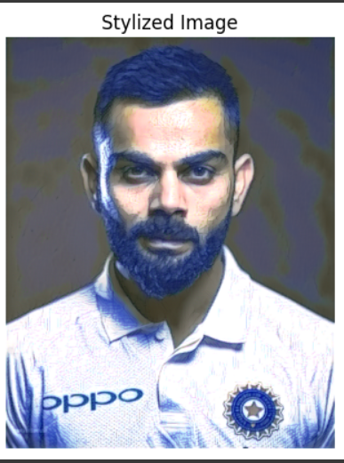

# TechElite-Internship
2025 summer internship and training in TechElite company.

--------------------------------------------------------------------------------------------------------------------------------------------

## OUTPUTS:  

### TASK 1: Text summarization tool ###

[{'summary_text': 'Docker is a platform for developing, shipping and running applications using containerization. A container is a lightweight, standalone, executable package that include everything which is required to run a piece of software. These containers can have volume associate with them to sustain data in case they are restarted after being stopped. docker-compose is a tool used in big projects to run multi-container applications. It has onion like structure it support caching of layers in case not all content of image is changed. Some useful Docker commands:docker build -t <my-image> . //build a images with my-image name. docker run -d -p 8000:80 < my- image) //run container in detach mode with port mapping of 8000 to 80.'}]

-------------------------------------------------------------------------------------------------------------------------------------------

### TASK 2: Speech Recognition System ###

**Transcription**: *HULLO THIS IS ANYMIS JAN FROM SPEECH TO TAKES TO THE COGNIS AND POGRAM AND I GREET YO OR TO MY POGRA THANK YOU*

-------------------------------------------------------------------------------------------------------------------------------------------

### TASK 3: Neural Style Transfer ###

#tweak these fields to get less or more stylized image  
<pre>content_weight = 1e4  
style_weight = 1e2
steps = 2000</pre>

### Style image:

  
  
  

------------------------------------------------------------------------------------------------------------------------------------------

### TASK 4: Generative Text Model 

**"why artist should fear A.I."**

*I think it's about being a good artist, and I think there's no reason why you should fear A.I. but you should be scared of a bad person. The first thing to do is to be as compassionate as you can be, and to be patient with yourself.

Now, there's no such thing as a bad person. You have to be a good artist. If you're an art critic, you're supposed to be a bad artist. I don't think art is bad because it's good, but it's bad because it's not good. You have to be a good person to show a piece. I know that I'm not perfect, but I've always been a good person, and I always wanted to be a good person. The problem with being a good person is that when you're bad you're not an artist, you're a bad person. You get to be bad because you're not an artist, but in the long run you're a bad person.

So I think it's important that we all step back and think of the people who were the bad people, and we think of the people who had a bad life, and we think of the people who*