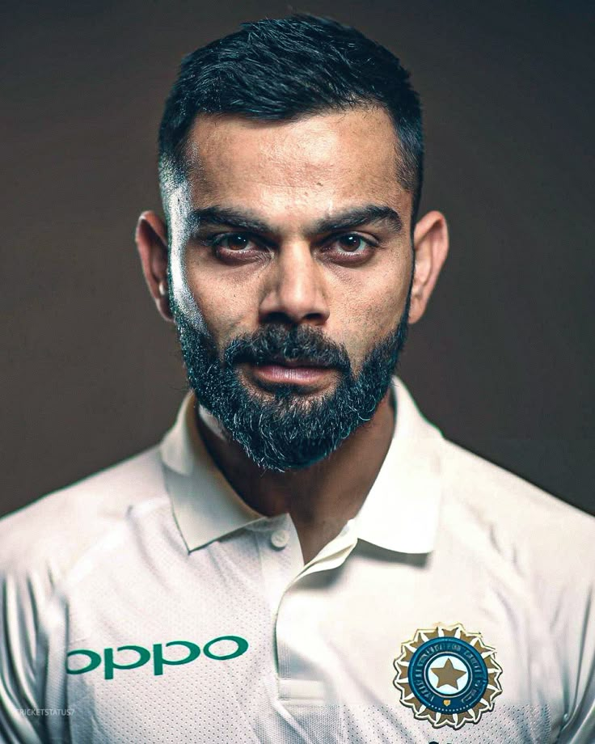

# techelite-internship
2025 summer internship and training in TechElite company.

--------------------------------------------------------------------------------------------------------------------------------------------
---

## OUTPUTS:  


### TASK 1: Text summarization tool ###

[{'summary_text': 'Docker is a platform for developing, shipping and running applications using containerization. A container is a lightweight, standalone, executable package that include everything which is required to run a piece of software. These containers can have volume associate with them to sustain data in case they are restarted after being stopped. docker-compose is a tool used in big projects to run multi-container applications. It has onion like structure it support caching of layers in case not all content of image is changed. Some useful Docker commands:docker build -t <my-image> . //build a images with my-image name. docker run -d -p 8000:80 < my- image) //run container in detach mode with port mapping of 8000 to 80.'}]


-------------------------------------------------------------------------------------------------------------------------------------------

### TASK 2: Speec Recognition System ###

**Transcription**:* HULLO THIS IS ANYMIS JAN FROM SPEECH TO TAKES TO THE COGNIS AND POGRAM AND I GREET YO OR TO MY POGRA THANK YOU
*
-------------------------------------------------------------------------------------------------------------------------------------------


### TASK 3: Neural Style Transfer ###

#tweak these fields to get less or more stylized image <br>
<pre>```content_weight = 1e4  
style_weight = 1e2
steps = 2000```</pre>

### Style image:


------------------------------------------------------------------------------------------------------------------------------------------

### TASK 4: Generative Text Model ###

